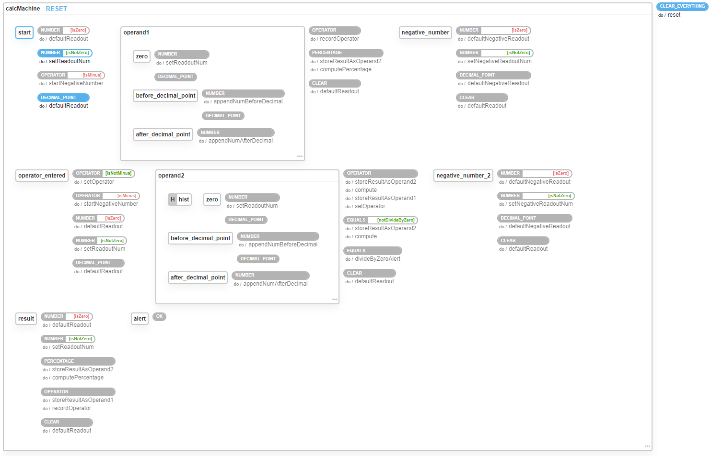

# Xstate Vue Calculator

Based on https://github.com/mukeshsoni/statechart-calculator, but upgraded to XState 4.x and moved to Vue 2.x with Vue Composition API.

* [XState 4.x](https://xstate.js.org/docs/)
* [Vue 2.x](https://vuejs.org/v2/guide/)
* [Vue 2.x Composition API](https://github.com/vuejs/composition-api#readme)
* [@xstate/vue add on](https://github.com/davidkpiano/xstate/tree/master/packages/xstate-vue)

👀 See the [calculator's state machine on the XState Visualizer](https://xstate.js.org/viz/?gist=06b130cce5e745cf605eee8a8a646de5)

